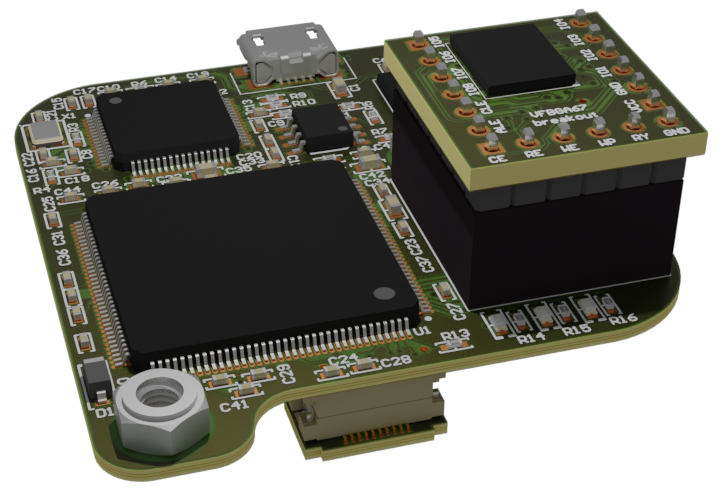

# The NandBug Hardware

## Overview

These hardware manufacturing files are part of the *NandBug* Project. Software files are available [here](https://github.com/courk/NandBug-Software).

*NandBug* is a small FPGA based board that I used in my [Running Custom Code on a Google Home Mini](https://courk.cc/running-custom-code-google-home-mini-part1) project.

The goal of *NandBug* is to make the NAND Flash of a *Google Home Mini* *In-System Programmable*. 

You can refer to the article for more background information and details.

